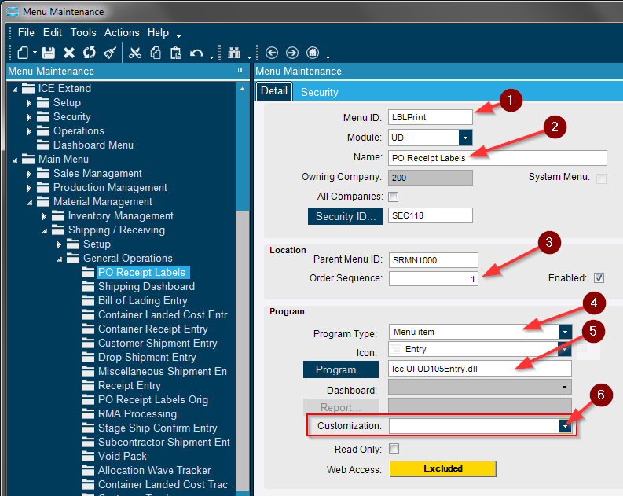
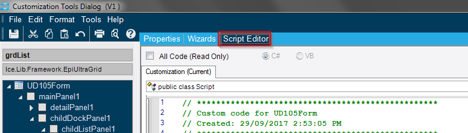

# Labels For POs
Generating individual tags in Epicor can be completed during Receipt Entry but generating an entire PO worth of labels can be tedious.  A tag must be printed for each individual line item.  This customization was created to pull in an entire PO and print all the labels simultaneously.

The PO Receipt Label Entry program is a customized menu for printing labels with barcodes. It was created using the User Defined Tables. The UD Tables are empty menus you can customize to fit your needs.

**Steps Involved:**

1. [Adding the UD Table to your Main Menu](#step-1)
2. [Rearranging the User Interface](#step-2)
3. [Adding Fields through Extended UD Table Maintenance](#step-3)
4. [Regenerate the Data Model](#step-4)
5. [Customize the Interface](#step-5)
6. [Add Foreign Key Views and Sub Table Key Views](#step-6)
7. [Reorganize the User Interface](#step-7)
8. [Remove Side Panel](#step-8)
9. [Add Line Button](#step-9)
10. [Auto Increment Child Key Field](#step-10)
11. [Add Entire PO Button](#step-11)
12. [Create the BAQ](#step-12)
13. [Create the BAQ Report](#step-13)
14. [Menu Security - Add the BAQ Report to the Main Menu](#step-14)
15. [Script Editor - Print BAQ Report Button](#step-15)

The basic functions of the PO Receipt Label Entry Program are:

1. Search for a PO and have it display all of its PO Line items in the top grid.
2. Highlight lines from the top grid and add them to the bottom grid.
3. Modify quantities for each label in the bottom table.
4. Print your list of labels through a BAQ Report.

#### Step 1 
*Adding the UD Table to your Main Menu*

**Navigate to this program from the Main Menu:**

_System Setup > Security Maintenance > **Menu Maintenance**_ 

**Here you are going to add the User Defined Menu program to your main menu within Epicor.**

1. Highlight which menu folder you want to add the User Defined Menu to.
2. Select the New Menu button from the new dropdown arrow.

**You must name your menu item and fill in the other credentials.**

1. Give your menu item an ID number. (Max 8 characters)
2. Enter a name for your menu item. This name will show within the Epicor Main Menu.
3. Give the menu item an order sequence. Usually between 0 and 200 where 0 is the top of the list and 200 is the bottom.
4. Leave program type as "Menu item".
5. Click the Program button and select between "Ice.UI.UD100Entry.dll" and "Ice.UI.UD110Entry.dll". Pick one that you have not already customized.
6. This customization field will be used later on after we customize the UD Menu.

After completing the above steps you must quit and restart your Epicor for the Menu changes to take effect.

#### Step 2
*Rearranging the User Interface*

**Enable Developer Mode and open your UD Menu.**

- After restarting Epicor, navigate through the main menu to where you added your user defined menu item. In this example it was _Material Management > Shipping/Receiving > PO Receipt Labels._ When you open this menu you'll be in the default User Defined Table Menu. This is what we will be customizing to create our PO Receipt Labels Program.

- We are now able to begin customizing our UD table menu, but first we will rearrange the menu's interface so it is more functional.
- There are two tabs in the first row, Detail and Child. Drag the Child tab down to bottom of the Epicor menu and drop it there.

- Your interface should now look like this.

- We will now drag the lower Detail tab across the Epicor Menu and drop it on the far right side of the interface.

- Your interface is now split into 3 panes, the top pane and the bottom two panes. From the tools dropdown select "save layouts." This will save this as your default interface configuration. You may be prompted to save and name your customization.

#### Step 3 
*Adding Fields through Extended UD Table Maintenance*

In our customized UD Menu we need access to Purchase Order data. For us to be able to access PO data we need to add a PO Field to our Parent UD table. We will be adding a PO field to our UD table through the Extended UD Table Maintenance Program. When we create this new field we will add a like value that links this new field to the PO Header data table in Epicor. Later on this will allow us to access PO information using a feature called Foreign Key Views.

**Navigate to this program from the Main Menu:**

_System Setup > System Maintenance > **Extended UD Table Maintenance**_

- Click New and search for and select the User Define Table that you're working with.

- If you are not sure which table you're working with open your UD Menu again and the table number will be displayed at the top of the window.

In Extended UD Table Maintenance:

1. Select New Column from the new dropdown.
2. Name your new column "PONum". The "\_c" will automatically be tacked onto the end.
3. Enter that this column is like the "PONum" column.
4. This table is like the "ERP" table "POHeader". Enter "ERP" in the first field.
5. Enter "POHeader" in the second field.
6. Set the data type as integer.

You must now run the "Regenerate the Data Model" process for this field to become active.

#### Step 4 
*Regenerate the Data Model*

Regenerating the data model updates all the fields within each SQL table. The new fields you've setup are added when this process takes place. In order to run this process you must connect to your server where you have your Epicor ERP Administrative console installed.  Open the Epicor Admistration Console.  From the sidebar select the Server you are working in.  Run Task Agent Configuration. Highlight the server you are working in. Under Actions, Select "Stop Agent".

1. Ensure all Epicor Users are logged off before running this process. Once the task agent has stopped, return to the Epicor Admin Console and Stop the Application Pool. This will take a few seconds. Once it's complete the green "Started" symbol will change to red and say "Stopped".

1. Now under Database Server Management you can select the server your working in.
2. From here you select the Regenerate Data Model.

- Select Generate and let the process run.

- Once the process is complete you'll see this popup notification. This window may be hidded in behind under other windows.

- Start the application pool again and turn on the task agent. You can now return to Epicor to see that the UD table is now in sync.

#### Step 5
*Customize the Interface*

- Go back and open the UD Table you are customizing. Ensure that developer mode is turned on. Under Tools select Customization.

- You'll now see the Customization Tools Dialog window.

- From the menu bar under tools select ToolBox.

From the ToolBox window you can now begin adding new features to your User Defined Program.

1. Select EpiTextbox from the Toolbox window.
2. Drag across your menu to create a new textbox.

Highlight your new text box and look at its properties in the Customization window.

1. Bind this text box to "PONum\_c" using the EpiBinding dropdown box.

#### Step 6 
*Add Foreign Key Views and Sub Table Key Views*

A Foreign Key View is a link between two SQL tables. We've setup a PO Number field in our User Defined Table. This field can now be linked to the actual PO Header Table. We can further link that field using a Sub Table to the PO Detail Table. With the Sub Table linked to the PO Detail table we will be able to display the PO Line items for whatever PO number we enter in our PO Number Field.

- To begin, open the Customization Tools Dialog window. Under Tools select Data Tools.

The Custom Data Dialog window will open. We will first create the Foreign Key View which relates our PO Number field to the PO Header Table.

1. Click the New Custom View Button.
2. Enter a Name for this Foreign Key View. Set the Parent View Name to your User Defined table.
3. Select the custom field you created earlier in Adding Fields through Extended UD Table Maintenance.
4. Click the Add button to create the Foreign Key View link.

- After you'll see a popup window letting you know the link has been created.

With the Foreign Key View created you can now create the Sub Table View. This will be a link from the PO Header table to the PO Detail table. This will allow you to access PO line information from our User Defined Menu.

1. Click the New Custom View button.
2. Create a name for your Sub Table Key View.
3. Select your original Foreign Key View as the Parent View Name.
4. Change this view type from a Foreign Key View to a Sub Table View.
5. Select PO Detail for your Sub Table Name.
6. Link your PONum\_c field to the PONUM field.
7. Click Add to save your link. Repeat steps 6 and 7 if you want to create more relationship links.
8. When your complete click Add to create your Sub Table View.

- You will again see the Foreign Key View Succeeded window appear once the Key view is created.

Now that you've setup the Sub Table View you can create a grid to display your related PO lines. Depending on what PO Number you enter in the PO Number field a list of PO Lines will display in your grid.

1. In the Customization window open the toolbox from the tools window and select EpiUltraGrid.
2. Drag the new Grid across your menu to create it.

- Highlight the Grid and change its properties in the Customizations Tools Dialog window. Set the EpiBinding to match your Sub Table View.

Save your changes, close out of your User Defined Menu and reopen it.

1. Create a new entry.
2. Fill in the PO field with a PO Number. The Line items will be populated in your grid.

#### Step 7 
*Reorganize the User Interface*

- You can now begin to clean up the user interface. We will not be using certain fields so we will hide them. Keys 2-5 and the Description will not be used. The Key1 field we will change to our Group Field.

- For Key1, Key2, Key3, Key4, Key5 and the Description field change the TabStop property to false.

- Near the botton of the properties tab change ReadOnly to True.

- For the Key 1 field change its text field to say "Group:".

- Rearrange your interface to look like this. We will pull the fields we won't be using off to the right side of the screen.

- By dragging the backdrop to the left the unwanted fields will be hidden off-screen.

- We will now modify which columns appear in the grid. Highlight the grid.

- Under the properties tab click the collections dropdown arrow. Use the "Toggle Hidden" button to mark every field hidden. Then uncheck only the fields you want to display.

#### Step 8
*Remove Side Panel*

- In every UD table there is a side panel on the left side of your screen. When you don't use this feature it just takes up a large portion of the user interface. We can hide this side panel using some custom code.

- Open the Customization Tools Dialog and navigate to the Script Editor Tab. This is where we will add the custom code to hide the side panel.

This Custom Code is taken from: [https://gist.github.com/strepicor/10b8e95e643c6c1ed0e10f7247b1148e](https://gist.github.com/strepicor/10b8e95e643c6c1ed0e10f7247b1148e)

At the beginning of the customized script there is a list of namespaces. These are used to reference other portions of code.

using System;
using System.ComponentModel;
using System.Data;
using System.Diagnostics;
using System.Windows.Forms;
using Ice.BO;
using Ice.UI;
using Ice.Lib;
using Ice.Adapters;
using Ice.Lib.Customization;
using Ice.Lib.ExtendedProps;
using Ice.Lib.Framework;
using Ice.Lib.Searches;
using Ice.UI.FormFunctions;

We need to add one additional namespace to this list. Add the System.Reflection Namespace to the botton of this list.

using System.Reflection;

You now have to add the below line of code to the public class Script section of code.

Infragistics.Win.UltraWinDock.UltraDockManager dock;

Within the InitializeCustomCode Section add the below code. Depending on which UD table you're using change the "UD105" within the code to match your UD table number.

Object obj = typeof(Ice.UI.App.UD105Entry.UD105Form).InvokeMember("baseDockManager", BindingFlags.Instance | BindingFlags.GetField | BindingFlags.NonPublic, null, UD105Form, null);
dock =  (Infragistics.Win.UltraWinDock.UltraDockManager)obj;                  
dock.DockAreas\[0\].Panes\[0\].Closed = true;

From the tools dropdown click test code.

Your result should return "Completed Successfully" at the bottom of your screen. If you have any error messages resolve them and rerun the test code process.  

Save your customization. Close and reopen your UD table, the side panel is now gone.

#### Step 9 
*Add Line Button*

Add a button to your menu just like you added the textbox and ultragrid. In the Customization Tools Dialog window under tools dropdown open the toolbox. Add an EpiButton to your User Defined Menu. Change the button's Name property to "AddLineBtn". Change the text property to "Add Line".

1. In the Customization Tools Dialog we will use the Event Wizard to automatically add some useful custom code to the script editor. For each dropdown below select "EpiButton", "AddLineBtn" and "Click" respectively.
2. Click the Add Arrow key to fill in the Control Event Code Window. Here you could manipulate the code before adding it to your script editor.
3. Click Update All Event Code to add the Control Event Code to your Script Editor. After run the Test Code Process to ensure your code still compiles properly.

In the script editor a few new lines of code have been added by the Event Wizard Tool.

Under **InitialCustomCode()** the below code has been added. It's used to trigger an event when the AddLineBtn is clicked. It triggers the AddLineBtn\_Click Function to run.

this.AddLineBtn.Click += new System.EventHandler(this.AddLineBtn\_Click);

Under **DestroyCustomCode()** the below code disables the button when your done using the UD Menu.

this.AddLineBtn.Click -= new System.EventHandler(this.AddLineBtn\_Click);

This new function is called when the AddLineBtn is clicked. We must add some code to it. Currently it does nothing.

private void AddLineBtn\_Click(object sender, System.EventArgs args)
{
    // \*\* Place Event Handling Code Here \*\*
}

A basic test can be done to see if the button event is triggering. Add a Messagebox line to your code and under tools run Test Code.

private void AddLineBtn\_Click(object sender, System.EventArgs args)
{
    // \*\* Place Event Handling Code Here \*\*
    MessageBox.Show("Test");
}

To test the button you must close the UD Menu and reopen it. Click the Add Line Button and a "Test" popup window should appear. You can now reprogram the function.

We want the AddLineBtn\_Click function to take the highlighted PO Line from the PO grid and add it to the bottom table. There are two variables you must change for this code to work with your setup:

- The UD105\_PODetail must be changed to match your EpiBinding property on your PO Ultragrid.
- The UD105A must be changed to match your UD Table. Keep the A because it is relevant to the child table.

private void AddLineBtn\_Click(object sender, System.EventArgs args)
    {
        // \*\* Place Event Handling Code Here \*\*
        //MessageBox.Show("Test");

        
//GATHER THE PO LINE DATA
        //Find the Highlighted PONum, POLine, OurQty, PartNum
        //\*\*\*\*\*Change "UD105\_PODetail" below to match the EpiBinding property on your PO UltraGrid\*\*\*\*\*
        EpiDataView POArray = ((EpiDataView)oTrans.EpiDataViews\["UD105\_PODetail"\]);

        int PONum = (int)POArray.dataView\[POArray.Row\]\["PONum"\];
        int POLine = (int)POArray.dataView\[POArray.Row\]\["POLine"\];
        decimal OurQty = (decimal)POArray.dataView\[POArray.Row\]\["XOrderQty"\];
        string PartNum = (string)POArray.dataView\[POArray.Row\]\["PartNum"\];
        string UOM = (string)POArray.dataView\[POArray.Row\]\["IUM"\];
        string Class = (string)POArray.dataView\[POArray.Row\]\["ClassID"\];

        //APPLY THE DATA TO THE NEW LINE
        //Create a new row for UD105A
        //\*\*\*\*\*Change "UD105A" below to match the UDTable your using\*\*\*\*\*
        EpiDataView labelsArray = ((EpiDataView)oTrans.EpiDataViews\["UD105A"\]);
        this.oTrans.GetNewChild();

        //Begin Editing Row
        labelsArray.dataView\[labelsArray.Row\].BeginEdit();          

        //Set the UD105A Variables to Match Variables Found Above
        //labelsArray.dataView\[labelsArray.Row\]\["PONum\_c"\] = PONum;
        //labelsArray.dataView\[labelsArray.Row\]\["POLine\_c"\] = POLine;
        //labelsArray.dataView\[labelsArray.Row\]\["LabelQty\_c"\] = Convert.ToInt32(OurQty);

        //REMOVE THE BELOW LINE OF CODE LATER ON
        labelsArray.dataView\[labelsArray.Row\]\["ChildKey1"\] = POLine;

        labelsArray.dataView\[labelsArray.Row\]\["ShortChar01"\] = PartNum;
        labelsArray.dataView\[labelsArray.Row\]\["ShortChar02"\] = UOM;
        labelsArray.dataView\[labelsArray.Row\]\["ShortChar03"\] = Class;

        //Complete Editing the Row and Save
        labelsArray.dataView\[labelsArray.Row\].EndEdit();
        this.oTrans.Update();
        this.oTrans.Refresh();
  
    }

Test your code for compiling errors and correct them if necessary. Save your customization. Close and reopen the UD Menu for the changes to take place. Test the Add Line button.

1. In your UD Menu create a parent file.
2. Name it Test.
3. Enter a known PO Number.
4. Highlight the PO Line and click Add Line.

A new child line will be created in the bottom table. The idea is that you can now search for PO's and generate a combined list of PO lines. There is an issue with our code that prevents you from adding a second line. You will get an error message telling you that you have a duplicate entry.

To prevent this issue we must create some code to auto increment the child key field to prevent duplicates.

#### Step 10 
*Auto Increment Child Key Field*

To prevent duplicates we must auto increment the child key field. The Child Key field is a primary key for the UD105A SQL table. It must be distinct so we will auto increment this field based on the value of the previous field.

Open the Form Event Wizard and add an EpiViewNotification Event Type for the child table, in this case the UD105A table. Click Update All Event Code. This event trigger allows you to run an event function when certain changes occur in the UD105A Child List. In this case we will run an event when a new line is added to the list.

After clicking Update All Event Code some additional code will be added to your Script Editor.

A variable for an EpiDataView will be created. This is used by the EpiViewNotification event trigger.

private EpiDataView edvUD105A;

Under InitialCustomCode() the below code has been added. It will trigger the event when a change occurs in the UD105A Child Key list.

this.edvUD105A = ((EpiDataView)(this.oTrans.EpiDataViews\["UD105A"\]));
this.edvUD105A.EpiViewNotification += new EpiViewNotification(this.edvUD105A\_EpiViewNotification);

Under DestroyCustomCode() the below code disables the event trigger when you close the UD Menu.

this.edvUD105A.EpiViewNotification -= new EpiViewNotification(this.edvUD105A\_EpiViewNotification);
this.edvUD105A = null;

This is the new event function that is called when a change occurs in the Child Key List. We must add some code to it. There is an IF statement that checks if a new row was added to the list. This is where we will add our code.

private void edvUD105A\_EpiViewNotification(EpiDataView view, EpiNotifyArgs args)
{
   // \*\* Argument Properties and Uses \*\*
   // view.dataView\[args.Row\]\["FieldName"\]
   // args.Row, args.Column, args.Sender, args.NotifyType
   // NotifyType.Initialize, NotifyType.AddRow, NotifyType.DeleteRow, NotifyType.InitLastView, NotifyType.InitAndResetTreeNodes
   if ((args.NotifyType == EpiTransaction.NotifyType.AddRow))
   {
       if ((args.Row > -1))
       {
       }
   }
}

The highlighted section of code is what we will add. It performs the auto increment process. When a new line is added to the Child Key list this code checks if the new line is the very first line. If so it sets the primary key to 001. If the new line is not the first row then it checks the previous lines value and increments it by 1.

private void edvUD105A\_EpiViewNotification(EpiDataView view, EpiNotifyArgs args)
{
   // \*\* Argument Properties and Uses \*\*
   // view.dataView\[args.Row\]\["FieldName"\]
   // args.Row, args.Column, args.Sender, args.NotifyType
   // NotifyType.Initialize, NotifyType.AddRow, NotifyType.DeleteRow, NotifyType.InitLastView, NotifyType.InitAndResetTreeNodes
   if ((args.NotifyType == EpiTransaction.NotifyType.AddRow))
   {
       if ((args.Row > -1))
       {

           
//Find the rownumber for this new line. args.Row is the row number but it starts at 0 so we add 1 to it. 
           int rowNum = args.Row +1;
           int prevRowNum;

           //If this is the first row save this as row 1.
           if (rowNum == 1)
           {
               view.dataView\[view.Row\].BeginEdit();
               view.dataView\[view.Row\]\["ChildKey1"\] = (rowNum).ToString("000");
               view.dataView\[view.Row\]\["Number01"\] = (rowNum);
               view.dataView\[view.Row\]\["Number03"\] = 1;
                    
               //Save Data to Row
               view.dataView\[view.Row\].EndEdit();
               this.oTrans.Update();
               this.oTrans.Refresh();                  
           }
           /\*If this is not row 1 read the previous row number.  Add 1 to the Previous rownum to get our current rownum.  
                If a row is deleted rownumbers can begin duplicating.  Reading the previous row number prevents duplication.
                \*/ 
          else
          {
               prevRowNum = Convert.ToInt32((decimal)view.dataView\[args.Row-1\]\["Number01"\]);
               rowNum = prevRowNum + 1;
                
               view.dataView\[view.Row\].BeginEdit();
               view.dataView\[view.Row\]\["ChildKey1"\] = (rowNum).ToString("000");
               view.dataView\[view.Row\]\["Number01"\] = (rowNum);
               view.dataView\[view.Row\]\["Number03"\] = 1;
                    
               //Save Data to Row
               view.dataView\[view.Row\].EndEdit();
               this.oTrans.Update();
               this.oTrans.Refresh();
           }
           
       }
   }
}

We must now return to our AddLineBtn\_Click Function and remove the following line of code.

//REMOVE THE BELOW LINE OF CODE LATER ON
labelsArray.dataView\[labelsArray.Row\]\["ChildKey1"\] = POLine;

Test your code for compiling errors and correct them if necessary. Save your customization. Close and reopen the UD Menu for the changes to take place. Test the button.

1. In your UD Menu create a parent file.
2. Name it Test.
3. Enter a known PO Number.
4. Highlight the PO Line and click Add Line.

A new child line will be created in the bottom table. The idea is that you can now search for PO's and generate a combined list of PO lines. You should no longer receive an error message if you continue to click the Add Line button.

#### Step 11 
*Add Entire PO Button*

This feature is not necessary but can be very useful when adding a PO with a large number of lines. Instead of clicking through each line one at a time this button will add every line on the PO to your list.

Follow the same steps from before for adding a button to your UD menu.

1. In the Customization Tools Dialog we will use the Event Wizard to automatically add some useful custom code. For each dropdown below select "EpiButton", "AddPOBtn" and "Click" respectively.
2. Click the Add Arrow key to fill in the Control Event Code Window. Here you could manipulate the code before adding it to your script editor.
3. Click Update All Event Code to add the Control Event Code to your Script Editor. After run the Test Code Process to ensure your code still compiles properly.

In the script editor a few new lines of code have been added by the Event Wizard Tool.

Under **InitialCustomCode()** the below code has been added. It's used to trigger an event when the AddPOBtn is clicked. It triggers the AddPOBtn\_Click Function to run.

this.AddPOBtn.Click += new System.EventHandler(this.AddPOBtn\_Click);

Under **DestroyCustomCode()** the below code disables the button when you're done using the UD Menu.

this.AddPOBtn.Click -= new System.EventHandler(this.AddPOBtn\_Click);

This new function is called when the AddPOBtn is clicked. We must add some code to it. Currently it does nothing.

private void AddPOBtn\_Click(object sender, System.EventArgs args)
    {
        // \*\* Place Event Handling Code Here \*\*
    }

A basic test can be done to see if the button event is triggering. Add a Messagebox line to your code and under tools run Test Code.

private void AddPOBtn\_Click(object sender, System.EventArgs args)
    {
        // \*\* Place Event Handling Code Here \*\*

        MessageBox.Show("Test");
    }

To test the button you must close the UD Menu and reopen it. Click the Add PO Button and a popup window should appear. You can now reprogram the function.

We want the AddPOBtn\_Click function to add each PO Line from the PO grid to the bottom table. There are two variables you must change for the below code to work with your setup:

- The UD105A must be changed to match your UD Table. Keep the A because it is relevant to the child table.
- The UD105\_PODetail must be changed to match your EpiBinding property on your PO Ultragrid.

private void AddPOBtn\_Click(object sender, System.EventArgs args)
    {
        // \*\* Place Event Handling Code Here \*\*

        
//MessageBox.Show("Test");

        EpiDataView labelsArray = ((EpiDataView)oTrans.EpiDataViews\["UD105A"\]);
        EpiDataView POArray = ((EpiDataView)oTrans.EpiDataViews\["UD105\_PODetail"\]);
        
        foreach(DataRow dr in POArray.dataView.Table.Rows) 
        {
            //GATHER THE PO LINE DATA
            //Find the Highlighted PONum, POLine, OurQty, PartNum
            int PONum = (int)dr\["PONum"\];
            int POLine = (int)dr\["POLine"\];
            decimal OurQty = (decimal)dr\["XOrderQty"\];
            string PartNum = (string)dr\["PartNum"\];
            string UOM = (string)dr\["IUM"\];
            string Class = (string)dr\["ClassID"\];

            //APPLY THE DATA TO THE NEW LINE
            //Create a new row for UD105A
            this.oTrans.GetNewChild();

            //Begin Editing Row
            labelsArray.dataView\[labelsArray.Row\].BeginEdit();

            //Set the UD105A Variables to Match Variables Found Above
            labelsArray.dataView\[labelsArray.Row\]\["PONum\_c"\] = PONum;
            labelsArray.dataView\[labelsArray.Row\]\["POLine\_c"\] = POLine;
            labelsArray.dataView\[labelsArray.Row\]\["LabelQty\_c"\] = Convert.ToInt32(OurQty);
            labelsArray.dataView\[labelsArray.Row\]\["ShortChar01"\] = PartNum;
            labelsArray.dataView\[labelsArray.Row\]\["ShortChar02"\] = UOM;
            labelsArray.dataView\[labelsArray.Row\]\["ShortChar03"\] = Class;

            //Complete Editing the Row and Save
            labelsArray.dataView\[labelsArray.Row\].EndEdit();
            this.oTrans.Update();
            this.oTrans.Refresh();
	}

    }

Test your code for compiling errors and correct them if necessary. Save your customization. Close and reopen the UD Menu for the changes to take place. Test the button.

1. In your UD Menu create a parent file.
2. Name it Test2.
3. Enter a known PO Number with multiple lines.
4. Click Add PO.

A new child line will be created in the bottom table for each PO Line above. The idea is that you can now add an entire PO with a single button click.

#### Step 12
*Create the BAQ*

**Navigate to this program from the Main Menu:**

_Executive Analysis > Business Activity Management > Setup > **Business Activity Query**_

We will now create a query that pulls data from your UD Table and presents the list as multiple bar code labels.

1. Click the new button.
2. Name your query.
3. Check the shared checkbox if necessary.

1. Switch the Query Builder Tab.
2. Search for the UD table you've been using. Make sure the A is added on the end because we want to use the Child Table not the parent table. Drag the table across to add it to your query.

1. Navigate to the Display.
2. Highlight which fields you want to add to your Query.
3. Click the right arrow to add the fields to your Query.

1. Go to the Analyze Tab.
2. Click the Test Button to run the Query and see the results.

In this example the results came back with three lines; Part A, B, and C. Part A had a label quantity of 5, Part B had a quantity of 4 and Part C had a quantity of 1. Each Part had a quantity of 1 unit per label. So instead of 3 lines we want a result of 10 lines. (5+4+1) To achieve this we need to modify our query.

If you're not seeing any results you must go to your custom UD menu and add some lines of data to a group.

1. Return to the Query Builder Tab.
2. From the New Subquery Dropdown add a new Inner Sub Query.

1. Switch to the Phrase Build tab.
2. Search for any SQL table with a large number of rows. The part table should work in this case. Drag the table to add it to the query.

For the time being we will set SubQuery2 as the TopLevel Table so we can test its results.

1. Navigate to the Subquery Options tab.
2. Change the type to TopLevel.

We must also switch SubQuery1 to an inner subquery for the time being.

1. From the dropdown switch to SubQuery1.
2. Switch the type to an InnerSubQuery.

1. Return to Subquery2.
2. Navigate to the Display Fields tab.
3. Add any field from the part table to the query.

1. Switch to the Analyze tab.
2. Click Test to run the query.
3. Make note of how many rows were returned. This will be your maximum number of labels per one PO line.

If the table does not return a large quantity of rows you'll need to pick another table.

1. Open the Display Fields tab.
2. Remove the one field you added.
3. Click the Calculated Field button.

1. Enter a name for this field.
2. Switch the data type to int.
3. Enter the following formula for your calculated field:
    - ROW\_NUMBER() Over (ORDER by Part.PartNum)
4. Click Check Syntax to test your formula. After save and close this window.

1. Switch to the Analyze tab.
2. Click Test to run the query. The result should simply be sequential numbers. This is what we want.

Now you can switch SubQuery2 back to an InnerSubQuery and Subquery1 to the TopLevel.

1. Navigate to the Phrase Build tab.
2. Click the subqueries filter. Add the SubQuery to your grid.
3. Join the two tables together.
4. Create the relationship between the two tables. The relation is the quantity of labels(Number02) is greater than or equal to the row count.

If you run the query again you should now have ten results(5+4+1).

#### Step 13
*Create the BAQ Report*

**Navigate to this program from the Main Menu:**

_Executive Analysis > Business Activity Management > General Operations > **BAQ Report Designer**_

Create a new BAQ Report and fill in the Detail tab.

1. Navigate to the Options tab.
2. Under the new dropdown select New Option Field.
3. Select the UD105A\_Key1 field.
4. Change the Label to say Group.

The BAQ Report designer will have created an SSRS Report which you can modify. Open the report and design a simple barcode label similar to the one shown below.

#### Step 14 
*Menu Security - Add the BAQ Report to the Main Menu*

**Navigate to this program from the Main Menu:**

_System Setup > Security Maintenance > **Menu Maintenance**_

Add this BAQ Report to the Epicor Main Menu. For Program Type use BAQ Report. Click the Report Button and select your BAQ Report you created. After you must quit and restart your Epicor for the Menu changes to take effect.

#### Step 15 
*Script Editor - Print BAQ Report Button*

We need to add a third button to the UD Menu. This will be the print button. Its function will be to automatically open the BAQ Report and have it ready to print your current group. Follow the steps from the previous button implementations. Use the event wizard to add the default code.

Within the function created by the event wizard add the following code.

Code Taken From: [http://erp.ittoolbox.com/groups/technical-functional/epicor-l/button-to-print-a-baq-report-5264754](http://erp.ittoolbox.com/groups/technical-functional/epicor-l/button-to-print-a-baq-report-5264754)

private void PrintBtn\_Click(object sender, System.EventArgs args)
    //Launch the BAQReport to print the labels
    //Pass a parmater into the BAQReport(A Customization on the BAQReport Form is Required to accept a Parameter)
    {
        // \*\* Place Event Handling Code Here \*\*

        
	//Update and save the lines before launching the BAQReport Form
        EpiDataView UD105A\_Arr = ((EpiDataView)oTrans.EpiDataViews\["UD105A"\]);
        this.oTrans.Update();
        this.oTrans.Refresh();

        if(UD105A\_Arr.Row > -1)
        {

            LaunchFormOptions lfo = new LaunchFormOptions(); 
    
            // \*\* this is where you would set the parameter to pass to the BAQReport Form
            lfo.ContextValue = UD105A\_Arr.dataView\[UD105A\_Arr.Row\]\["Key1"\];
    
            // \*\* LBLPRINT would be the MenuID for the BAQReport w/ Customization                    
            ProcessCaller.LaunchForm(oTrans, "UDLBLRPT", lfo); 
        }
   
    }

Before the print button will work properly we must customize your BAQ Report menu you created. Navigate to where it is stored in the main menu. Make sure your in Developer Mode and open the BAQ Report Menu. From Tools open Customization and navigate to Form Event Wizard.

1. Select Load from the Event Type dropdown.
2. Use the right arrow to add that event.
3. Click Update All Event Code.

Add the following highlighted lines of code to the Script Editor. Save the customization.

private void BAQReportForm\_Load(object sender, EventArgs args)
{
    // Add Event Handler Code
    
if (BAQReportForm.LaunchFormOptions != null) 
    { 
        EpiDataView edv = (EpiDataView)oTrans.EpiDataViews\["ReportParam"\]; 
        edv.dataView\[edv.Row\]\["field1"\] = BAQReportForm.LaunchFormOptions.ContextValue.ToString(); 
    }
}

We must now set both the UD Menu Customization as the default menu as well as the BAQ Report Customization. In Menu Maintenance change the Customization tab to your customization you created. You must close out of Epicor and Log back in for the changes to take place.

1. Now within your UD Menu you can open a group with PO Lines.
2. Click the Print Button and the PO Label Report will open.
3. The Group field will automatically be filled with the group you have open in the UD Menu.
4. Print preview the barcode labels and you will get the barcodes related to your group you created.

The results will appear in a PDF which you can then print to your barcode printer.

If you want to add this User Defined Menu to the MES Screen follow these instructions: [https://community.spiceworks.com/topic/1875067-dashboard-to-mes-button-e10](https://community.spiceworks.com/topic/1875067-dashboard-to-mes-button-e10)
